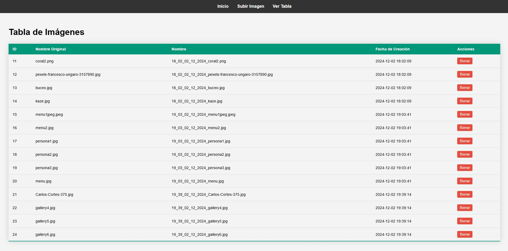
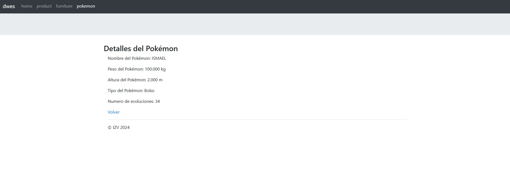
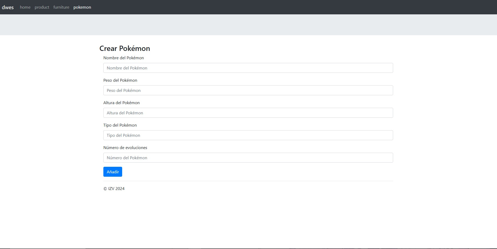

# Proyecto de Gestión de Pokémon

Este proyecto es una aplicación web desarrollada con el framework Laravel. La aplicación permite gestionar una lista de Pokémon, incluyendo funcionalidades para crear, editar, ver y eliminar Pokémon. Además, la aplicación incluye funcionalidades de autenticación de usuarios.

## Funcionalidades

- **Autenticación de Usuarios**: Los usuarios pueden iniciar y cerrar sesión en la aplicación.
- **Gestión de Pokémon**: Los usuarios autenticados pueden crear, editar, ver y eliminar Pokémon.
- **Gestión de Productos y Muebles**: Además de Pokémon, la aplicación permite gestionar productos y muebles.

## Estructura del Proyecto

- **app/Http/Controllers**: Contiene los controladores de la aplicación, como `MainController`, `ProductController`, `FurnitureController` y `PokemonController`.
- **database/migrations**: Contiene las migraciones de la base de datos, como la creación de las tablas `jobs` y `job_batches`.
- **resources/views**: Contiene las vistas de la aplicación, como las vistas para crear, editar, ver y listar Pokémon.
- **routes/web.php**: Define las rutas de la aplicación.

## Interfaz

### Tabla

### Visualizador de  pokemon

### Insertar Pokemon

